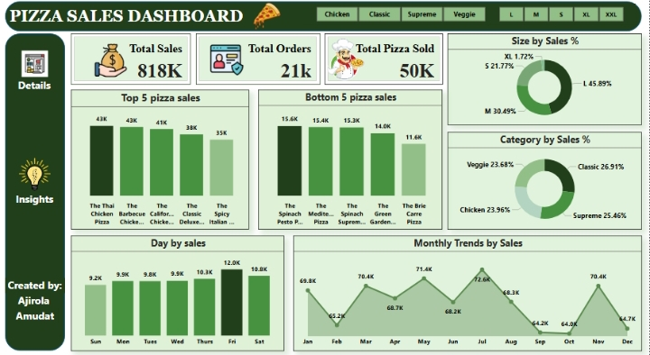

# PIZZA-SALES-ANALYSIS-
# 🍕 Pizza Sales Dashboard

## 📑 Table of Contents
- [Description](#description)
  
- [Overview](#overview)
  
- [Problem Statement](#problem-statement)
  
- [Objective](#objective)
 
- [Key areas analyzed]()

- [Data Source]()

- [Data Description]()
  
- [Tools Used](#tools-used)

- [Data cleaning]()
  
- [Analysis and visualization]()
  
- [Dashboard](#dashboard)
 
- [Key metrics]()
  
- [Insights Gained](#insights-gained)
  
- [Recommendation](#recommendation)
  
- [Contact](#contact)

## 📄 Description
A pizza company wanted to better understand customer preferences and improve business decisions using sales data. This dashboard brings their data to life revealing key patterns across products, time, and customer choices.

## 📌 Project Overview
This Power BI dashboard was built to analyze a pizza company's sales data. It uncovers which pizzas are the most and least popular, when customers are most likely to order, and what size and flavor categories are preferred. It supports smarter business decisions based on clear visual insights.

## ❓ Problem Statement
The business lacked visibility into:

📍 Which pizzas perform best or worst

📍Customer preferences for pizza sizes and flavors

📍The best days and months for sales

📍Performance comparisons across categories (e.g., Veggie vs Chicken)

This made it difficult to plan production, pricing, staffing, and promotions.

## 🎯 Objective
1️⃣ Identify top and bottom-selling pizzas

2️⃣ Analyze sales by pizza **category** and **size**

3️⃣ Discover best-performing **days** and **months**

4️⃣ Support business decisions through easy-to-understand visuals

## 📊 Key Areas Analysed
📍Top 5 and Bottom 5 pizzas by sales

📍 Daily sales patterns (Sunday to Saturday)

📍 Monthly sales trends

📍 Pizza sales by size (S, M, L, XL, XXL)

📍 Pizza sales by category (Classic, Supreme, Chicken, Veggie)

## 📚 Data Source

The dataset was obtained from kaggle website

Here's the link to the dataset: https://www.kaggle.com/datasets/nextmillionaire/pizza-sales-dataset

## 🧾 Dataset Description
The dataset provides detailed information about pizza orders over a given period.

| Column Name         | Description                                                                 |
|---------------------|-----------------------------------------------------------------------------|
| **pizza_id**        | A unique identifier assigned to each distinct pizza variant available for ordering. |
| **order_id**        | A unique identifier for each order made, which links to multiple pizzas.    |
| **pizza_name_id**   | An identifier linking to a specific name of the pizza.                      |
| **quantity**        | The number of units of a specific pizza variant ordered within an order.    |
| **order_date**      | The date when the order was placed.                                         |
| **order_time**      | The time when the order was placed.                                         |
| **unit_price**      | The cost of a single unit of the specific pizza variant.                    |
| **total_price**     | The aggregated cost of all units of a specific pizza variant in an order.   |
| **pizza_size**      | Represents the size of the pizza (e.g., small, medium, large).              |
| **pizza_category**  | Indicates the category of the pizza, such as vegetarian, non-vegetarian, etc. |
| **pizza_ingredients** | Provides a list or description of the ingredients used in the pizza.       |
| **pizza_name**      | Specifies the name of the specific pizza variant ordered.                   |

## 🛠️ Tools Used
- **Power BI** – for interactive dashboards and visualizations  
- **Microsoft Excel** – for initial data cleaning and formatting

## 🧹 Data Cleaning
📍 Removed duplicates and null values

📍 Standardized pizza names, sizes, and categories  

📍 Converted date columns to readable formats

### Analysis & Visualization
📍 Grouped and summarized data using DAX formulas in Power BI  

📍 Built visualizations like bar charts, donut charts, and line graphs  

📍 Applied slicers for interactive filtering by category and size

## 📈 Dashboard  

## 🔢 Key Metrics

| Metric               | Value       |
|----------------------|-------------|
| **Total Sales**      | 818,000     |
| **Total Orders**     | 21,000       |
| **Total Pizzas Sold**| 50,000       |

## 📊 Insights gained 
✅ **Best and Worst Performing Pizzas**

✅ **Top Performers**:  
**Thai Chicken Pizza** leads with **43,000** units sold, followed by **Barbecue Chicken** and **California Chicken**

❌ **Lowest Performers**:  

**Brie Carre Pizza** is the least popular with only **11,600** units sold, others include **Spinach-based varieties**

Indicating potential areas to **improve** or **phased out underperforming varieties**.

## ✅ **Pizza size sales**
**Large-sized** dominate sales **45.89%**, while **X-Large** contribute atleast **1.72%.**

This trends suggest that customers prefer **larger pizzas** over **regular** or **medium**, but the **extra large** might be too big or not cost effective for most customers.

## ✅ **Pizza Category sales**
**Classic** dominate sales **26.91%**, followed by **Supreme**  **25.46%**. The least is **Veggie** **23.68%**.

This indicates that customer preferences are **Classic & Supreme**

## ✅ **Sales trends by days**
The highest sales occurs on **friday**, while **Sunday** had the lowest sales 

This indicates a strong **weekend effect**, with Fridays being popular for ordering pizza, potentially due end of week relaxation or  social gatherings.

## ✅ **Monthly trends by sales**
Sales **peaks** in **July** **72.6k**, while in **October** sales **dips** to the lowest **62.4k**.

These trends could correlate with seasonal events, holidays or marketing campaigns influencing customer behavior 

## ✍️ Recommendations
1️⃣ **Promote top-performing pizzas** like **Thai Chicken and Barbecue Chicken**.

2️⃣ **Reevaluate low-performers** like **Brie Carre Pizza and spinach-based varieties**.

3️⃣ **Focus production on L and M sizes**, which make up over 75% of total sales.

4️⃣ **Increase staffing and stock** for peak days **(Fridays)** and peak months **(June)**.

5️⃣ **Introduce offers or discounts** on low-performing days (Sundays) and off-peak months (like September)

## 👩🏽‍💻 Contact:
Created by: **Ajirola Amudat**  
_Data Analyst | Power BI Enthusiast_
📧 For collaboration or inquiries, connect with me on [LinkedIn](https://www.linkedin.com/in/ajirola-amudat-a-3083882b2?utm_source=share&utm_campaign=share_via&utm_content=profile&utm_medium=android_app)

